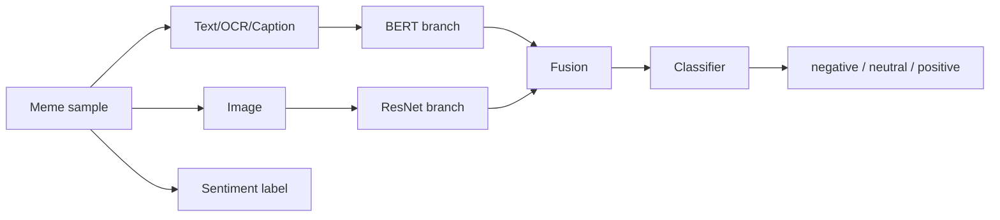
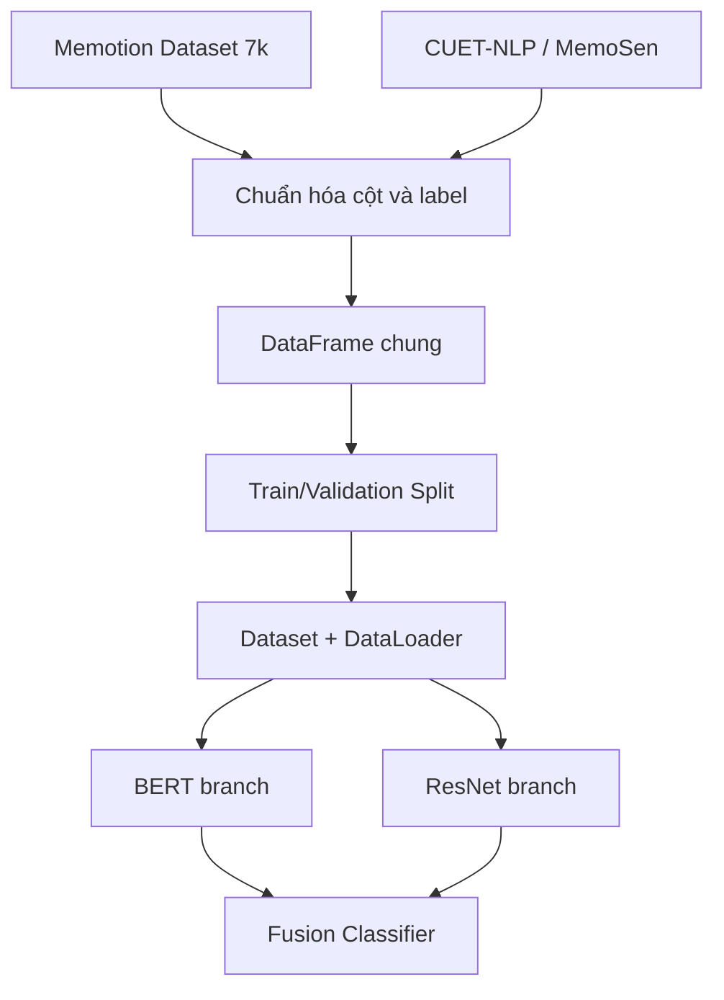

# Giới thiệu và giải thích 2 tập dataset

Project này sử dụng 2 dataset Kaggle cho bài toán phân loại cảm xúc/sentiment đa phương thức:

1. **Memotion Dataset 7k**
2. **Multimodal Sentiment Analysis CUET-NLP / MemoSen**

Cả hai dataset đều phù hợp với bài toán multimodal vì mỗi mẫu dữ liệu có thể khai thác đồng thời:

```text
text + image + label
```

Trong project, ta chuẩn hóa nhãn về 3 lớp:

```text
negative
neutral
positive
```

## 1. Vì sao chọn 2 dataset này?

Bài toán yêu cầu:

```text
Input gồm cả text + image
Text xử lý riêng bằng BERT
Image xử lý riêng bằng ResNet
Fusion hai branch
Classifier phân loại cảm xúc/sentiment
```

Hai dataset này đều là dataset meme. Meme là dạng dữ liệu rất hợp cho multimodal sentiment vì ý nghĩa thường không nằm riêng ở text hoặc riêng ở ảnh, mà nằm ở sự kết hợp giữa hai phần.

Ví dụ:

```text
Text: "Great, another exam"
Image: khuôn mặt mệt mỏi
Label: negative hoặc sarcastic/negative
```

Nếu chỉ đọc chữ `"Great"`, model có thể hiểu sai là positive. Nếu nhìn ảnh mà không đọc chữ, model cũng thiếu ngữ cảnh. Vì vậy text branch và image branch cần được xử lý riêng rồi fusion.

Sơ đồ dữ liệu:



## 2. Dataset 1: Memotion Dataset 7k

Link Kaggle:

```text
https://www.kaggle.com/datasets/williamscott701/memotion-dataset-7k
```

### 2.1. Tổng quan

**Memotion Dataset 7k** là dataset dùng cho bài toán phân tích meme. Dataset này xuất phát từ hướng nghiên cứu **Memotion Analysis**, nơi meme được phân tích theo nhiều khía cạnh như:

- overall sentiment
- humor
- sarcasm
- offensiveness
- motivation

Theo mô tả công khai của Kaggle, dataset này phục vụ sentiment classification của meme và liên quan tới Memotion Analysis/SemEval. Các tài liệu nghiên cứu về Memotion cũng mô tả task sentiment là phân loại meme thành các lớp như positive, negative và neutral.

Trong project này, ta chỉ sử dụng phần:

```text
overall_sentiment
```

để đưa về bài toán 3 lớp:

```text
negative / neutral / positive
```

### 2.2. Một mẫu dữ liệu gồm gì?

Một mẫu trong Memotion thường có:

| Thành phần | Ý nghĩa |
|---|---|
| Image | ảnh meme |
| Text/OCR | chữ xuất hiện trong meme hoặc text đã trích xuất |
| Overall sentiment | nhãn sentiment tổng thể |
| Humor-related labels | nhãn phụ như humor, sarcasm, offensive, motivational |

Trong code, ta lấy:

```text
text      -> đưa vào BERT/DistilBERT
image     -> đưa vào ResNet50
sentiment -> label để train classifier
```

### 2.3. Vì sao dataset này phù hợp?

Memotion phù hợp vì:

- Meme có cả chữ và ảnh.
- Nhãn sentiment có thể dùng cho classification.
- Có nhiều yếu tố ngữ nghĩa phức tạp như châm biếm, hài hước, xúc phạm.
- Chỉ dùng text hoặc chỉ dùng image thường không đủ.

Ví dụ về cách model sử dụng dataset:

```text
image file + OCR text -> model -> positive/neutral/negative
```

### 2.4. Các nhãn có thể gặp

Trong Memotion, nhãn sentiment có thể ở dạng:

```text
positive
neutral
negative
very positive
very negative
```

Trong project, ta gom nhãn cực tính mạnh về nhãn chính:

```text
very positive -> positive
very negative -> negative
```

Mapping trong code:

```python
mapping = {
    "positive": "positive",
    "very positive": "positive",
    "negative": "negative",
    "very negative": "negative",
    "neutral": "neutral",
}
```

Lý do gom nhãn:

- Hai dataset cần có cùng hệ nhãn.
- Dataset thứ hai dùng 3 lớp chính.
- Bài toán trở nên rõ ràng hơn: positive, neutral, negative.

### 2.5. Lưu ý khi dùng Memotion

Một số vấn đề có thể gặp:

| Vấn đề | Cách xử lý trong project |
|---|---|
| Tên cột metadata khác nhau | code tự đoán cột text/image/label |
| Ảnh lỗi hoặc truncated | code lọc ảnh lỗi và fallback ảnh đen |
| Nhãn có nhiều mức độ | chuẩn hóa về 3 lớp |
| Text OCR có thể nhiễu | tokenizer BERT xử lý sau khi đọc text |

## 3. Dataset 2: Multimodal Sentiment Analysis CUET-NLP / MemoSen

Link Kaggle:

```text
https://www.kaggle.com/competitions/multimodal-sentiment-analysis-cuet-nlp/data
```

### 3.1. Tổng quan

Dataset **Multimodal Sentiment Analysis CUET-NLP** là dataset/competition trên Kaggle cho sentiment analysis từ meme. Mô tả Kaggle cho biết CUET NLP Lab phát triển một benchmark multimodal Bengali dataset để phân tích sentiment của meme, gồm khoảng 4K meme với nhãn 3 lớp.

Dataset này cũng liên quan tới **MemoSen**, một dataset multimodal cho sentiment analysis của meme tiếng Bengali. Theo paper MemoSen, dataset có **4417 memes** với ba nhãn:

```text
positive
negative
neutral
```

### 3.2. Một mẫu dữ liệu gồm gì?

Một mẫu thường có:

| Thành phần | Ý nghĩa |
|---|---|
| Image | ảnh meme |
| Text/Caption | text đi kèm hoặc text được trích từ meme |
| Sentiment label | positive, negative hoặc neutral |

Trong project:

```text
text/caption -> BERT/DistilBERT
image        -> ResNet50
label        -> CrossEntropyLoss
```

### 3.3. Vì sao dataset này phù hợp?

Dataset này phù hợp vì:

- Cũng là dataset meme.
- Có cả text và image.
- Nhãn sentiment đã ở dạng 3 lớp.
- Có thể gộp với Memotion sau khi chuẩn hóa label.
- Giúp tăng lượng dữ liệu cho mô hình multimodal.

### 3.4. Điểm khác biệt so với Memotion

| Tiêu chí | Memotion Dataset 7k | CUET-NLP / MemoSen |
|---|---|---|
| Loại dữ liệu | Meme | Meme |
| Modality | Text + Image | Text + Image |
| Ngôn ngữ chính | thường là tiếng Anh | Bengali |
| Nhãn chính dùng trong project | overall sentiment | sentiment |
| Số lớp sentiment dùng | chuẩn hóa về 3 lớp | 3 lớp |
| Nhãn phụ | humor, sarcasm, offensive, motivation | thường tập trung sentiment |

Điểm quan trọng: hai dataset có thể khác ngôn ngữ. Code hiện tại dùng:

```python
distilbert-base-uncased
```

Model này mạnh cho tiếng Anh hơn Bengali. Nếu muốn tối ưu cho cả hai dataset, có thể đổi sang multilingual model:

```python
text_model_name = "bert-base-multilingual-cased"
```

hoặc:

```python
text_model_name = "xlm-roberta-base"
```

Nếu dùng `xlm-roberta-base`, vẫn dùng được `AutoTokenizer` và `AutoModel`, nhưng cần kiểm tra lại GPU memory vì model có thể nặng hơn.

## 4. Vì sao cần chuẩn hóa 2 dataset?

Khi dùng 2 dataset khác nhau, chúng có thể khác:

- tên cột text
- tên cột image
- tên cột label
- cách mã hóa nhãn
- cấu trúc folder ảnh
- ngôn ngữ text

Vì vậy code phải đưa chúng về cùng một format:

```text
text | image_path | label_name | source | label
```

Trong code:

```python
out = pd.DataFrame(
    {
        "text": df[text_col].fillna("").astype(str),
        "image_path": df[image_col].apply(lambda x: resolve_image_path(x, image_index)),
        "label_name": df[label_col].apply(normalize_label),
        "source": dataset_name,
    }
)
```

Sau đó gộp:

```python
data = pd.concat(datasets, ignore_index=True)
```

Và gán nhãn số:

```python
label2id = {"negative": 0, "neutral": 1, "positive": 2}
data["label"] = data["label_name"].map(label2id)
```

## 5. Cấu trúc dữ liệu sau khi xử lý

Sau khi load xong, dataframe `data` có dạng:

| Cột | Ý nghĩa |
|---|---|
| `text` | nội dung chữ đưa vào text encoder |
| `image_path` | đường dẫn ảnh thật trong Kaggle |
| `label_name` | nhãn dạng chữ |
| `source` | dataset gốc: `memotion7k` hoặc `cuet_msa` |
| `label` | nhãn số cho PyTorch |

Ví dụ:

```text
text: "When the teacher says surprise test"
image_path: "/kaggle/input/.../image_001.png"
label_name: "negative"
source: "memotion7k"
label: 0
```

## 6. Cách hai dataset đi vào mô hình

Sau khi gộp, model không cần biết sample đến từ dataset nào. Mỗi sample đều có format thống nhất:

```text
text + image + label
```

Luồng xử lý:



## 7. Vấn đề cần lưu ý khi gộp dataset

### 7.1. Khác ngôn ngữ

Memotion thường là tiếng Anh, còn CUET-NLP/MemoSen là Bengali.

Nếu dùng:

```python
distilbert-base-uncased
```

thì nhánh text có thể hiểu tiếng Anh tốt hơn Bengali.

Nếu muốn công bằng hơn cho cả hai dataset, nên dùng:

```python
bert-base-multilingual-cased
```

hoặc:

```python
xlm-roberta-base
```

### 7.2. Khác phân bố nhãn

Hai dataset có thể không cân bằng giống nhau. Ví dụ một dataset có nhiều positive, dataset còn lại có nhiều neutral.

Nên kiểm tra:

```python
print(data.groupby(["source", "label_name"]).size())
```

Nếu lệch nhãn nhiều, nên dùng `class weights`.

### 7.3. Khác phong cách meme

Meme tiếng Anh và meme Bengali có thể khác:

- ngôn ngữ
- văn hóa
- biểu tượng
- kiểu hài hước
- cách dùng hình ảnh

Điều này làm bài toán khó hơn, nhưng cũng khiến project có giá trị hơn vì model phải học multimodal từ nhiều nguồn.

### 7.4. Ảnh lỗi

Một số ảnh trong dataset Kaggle có thể bị hỏng. Project đã thêm:

```python
ImageFile.LOAD_TRUNCATED_IMAGES = True
```

và hàm:

```python
is_valid_image(path)
```

để giảm lỗi khi train.

## 8. Nên mô tả 2 dataset trong báo cáo như thế nào?

Bạn có thể viết:

```text
Trong bài, em sử dụng hai bộ dữ liệu meme đa phương thức từ Kaggle. Bộ dữ liệu
thứ nhất là Memotion Dataset 7k, được xây dựng cho bài toán Memotion Analysis,
bao gồm ảnh meme, nội dung text/OCR và các nhãn như overall sentiment, humor,
sarcasm, offensive và motivation. Trong phạm vi bài này, em sử dụng nhãn
overall sentiment và chuẩn hóa về ba lớp negative, neutral và positive.

Bộ dữ liệu thứ hai là Multimodal Sentiment Analysis CUET-NLP/MemoSen, một
benchmark multimodal cho sentiment analysis của meme, gồm ảnh meme, text/caption
và nhãn sentiment ba lớp positive, negative, neutral. Hai dataset được đưa về
cùng format gồm text, image_path và label để huấn luyện mô hình fusion giữa
BERT/DistilBERT và ResNet50.
```

## 9. Bảng so sánh ngắn gọn

| Dataset | Dạng dữ liệu | Input dùng trong project | Label dùng trong project | Vai trò |
|---|---|---|---|---|
| Memotion Dataset 7k | Meme | Text/OCR + Image | Overall sentiment | nguồn dữ liệu meme có nhãn sentiment |
| CUET-NLP / MemoSen | Meme | Text/Caption + Image | Sentiment | nguồn dữ liệu meme 3 lớp sentiment |

## 10. Liên hệ với mô hình BERT + ResNet

Với cả hai dataset:

```text
text  -> BERT/DistilBERT -> text feature
image -> ResNet50        -> image feature
```

Sau đó:

```text
text feature + image feature -> fusion -> classifier -> label
```

Điểm quan trọng là cả hai dataset đều có đủ dữ liệu cho hai branch.

Nếu dataset chỉ có text, không dùng được image branch.
Nếu dataset chỉ có image, không dùng được text branch.
Hai dataset này có cả hai nên phù hợp với yêu cầu.

## 11. Nguồn tham khảo

- Memotion Dataset 7k trên Kaggle: <https://www.kaggle.com/datasets/williamscott701/memotion-dataset-7k>
- Multimodal Sentiment Analysis CUET-NLP trên Kaggle: <https://www.kaggle.com/competitions/multimodal-sentiment-analysis-cuet-nlp/data>
- MemoSen paper trên ACL Anthology: <https://aclanthology.org/2022.lrec-1.165/>
- SemEval/Memotion-related paper: <https://arxiv.org/pdf/2005.10915>

## 12. Kết luận

Hai dataset được chọn vì chúng cùng thuộc miền **meme sentiment analysis** và đều có cấu trúc đa phương thức.

Tóm tắt:

```text
Memotion 7k       -> meme tiếng Anh, nhiều nhãn phụ, dùng overall sentiment
CUET-NLP/MemoSen  -> meme Bengali, nhãn sentiment 3 lớp
```

Sau khi chuẩn hóa, cả hai được gộp thành một tập dữ liệu chung để huấn luyện mô hình:

```text
Text + Image -> BERT branch + ResNet branch -> Fusion -> Classifier
```

Đây là lý do hai dataset này phù hợp với bài toán phân loại cảm xúc/sentiment đa phương thức.
