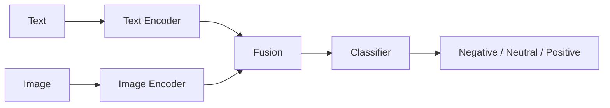
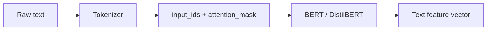
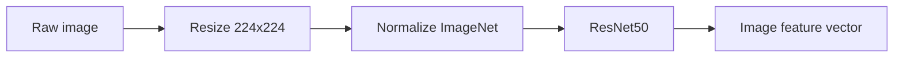
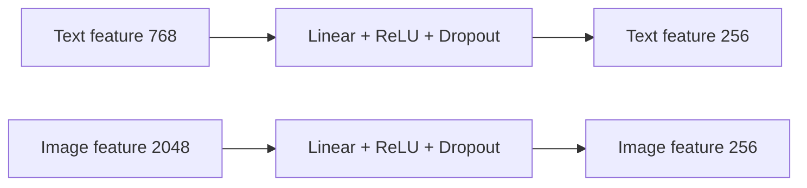
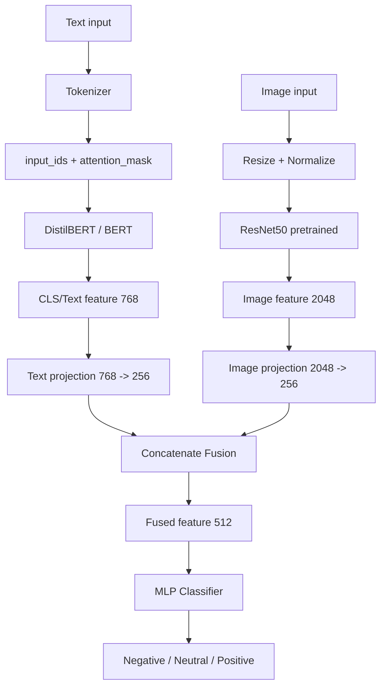
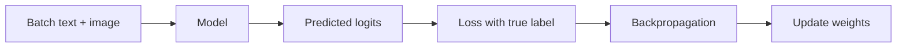

# Giải thích chi tiết ý tưởng Multimodal Emotion Classification

Tài liệu này giải thích ý tưởng của bài toán:

```text
Phân loại cảm xúc/sentiment đa phương thức từ text + image
```

Code chính của project nằm trong:

```text
kaggle_multimodal_emotion_fusion.py
```

## 1. Bài toán đang làm là gì?

Ta có các mẫu dữ liệu dạng meme hoặc bài đăng có cả:

- **Text**: câu chữ, caption, OCR text.
- **Image**: ảnh meme hoặc ảnh đi kèm.
- **Label**: nhãn cảm xúc/sentiment, ví dụ `negative`, `neutral`, `positive`.

Mục tiêu:

```text
Input:  text + image
Output: nhãn cảm xúc/sentiment
```

Ví dụ:

| Text | Image | Label |
|---|---|---|
| "I am so happy today" | ảnh người cười | positive |
| "This is terrible" | ảnh buồn/tức giận | negative |
| "Okay, fine" | ảnh bình thường | neutral |

Trong meme, chỉ nhìn text hoặc chỉ nhìn ảnh đôi khi không đủ. Vì vậy ta dùng cả hai.

## 2. Vì sao cần dùng cả text và image?

Một meme thường truyền ý nghĩa bằng sự kết hợp giữa chữ và ảnh.

Ví dụ:

```text
Text: "Great, another Monday"
Image: khuôn mặt mệt mỏi
```

Nếu chỉ đọc text, chữ `"Great"` có vẻ positive. Nhưng ảnh mệt mỏi làm câu này có thể mang nghĩa châm biếm hoặc negative.

Ngược lại:

```text
Text: "I failed again"
Image: nhân vật đang cười tự giễu
```

Nếu chỉ nhìn text, có thể negative. Nhưng ảnh có thể làm sắc thái nhẹ hơn hoặc hài hước hơn.

Vì vậy mô hình multimodal cố gắng học từ cả:

```text
ý nghĩa ngôn ngữ + tín hiệu hình ảnh
```

## 3. Multimodal nghĩa là gì?

`Modal` có thể hiểu là một dạng dữ liệu.

Trong bài này:

- Text là một modality.
- Image là một modality.

`Multimodal` nghĩa là mô hình dùng nhiều loại dữ liệu cùng lúc.

Sơ đồ tổng quát:



## 4. Ý tưởng lớn của mô hình

Ta không đưa text và image vào chung một model ngay từ đầu. Thay vào đó:

1. Text được xử lý bằng một model chuyên hiểu ngôn ngữ.
2. Image được xử lý bằng một model chuyên hiểu hình ảnh.
3. Mỗi model tạo ra một vector đặc trưng.
4. Ghép hai vector này lại.
5. Train một classifier để dự đoán label.

Sơ đồ:

```text
Text  ---> BERT/DistilBERT ---> text feature  ----\
                                                   +---> Fusion ---> Classifier ---> Label
Image ---> ResNet50        ---> image feature ----/
```

Trong code:

```python
text_feat = text_outputs.last_hidden_state[:, 0, :]
image_feat = self.image_encoder(image)
fused = torch.cat([text_feat, image_feat], dim=1)
logits = self.classifier(fused)
```

## 5. Text branch là gì?

Text branch là nhánh xử lý dữ liệu chữ.

Trong project này, text branch dùng:

```python
distilbert-base-uncased
```

hoặc có thể đổi sang:

```python
bert-base-uncased
```

### BERT làm gì?

BERT nhận một câu text, sau đó biến câu đó thành vector số.

Máy tính không hiểu trực tiếp câu:

```text
I am very happy today
```

Vì vậy tokenizer biến câu thành token id:

```text
[101, 1045, 2572, 2200, 3407, 2651, 102]
```

Sau đó BERT biến các token này thành embedding.

Sơ đồ:



Trong code:

```python
encoded = tokenizer(
    row["text"],
    padding="max_length",
    truncation=True,
    max_length=CFG.max_len,
    return_tensors="pt",
)
```

Sau đó đưa vào model:

```python
text_outputs = self.text_encoder(
    input_ids=input_ids,
    attention_mask=attention_mask
)
```

Lấy vector đại diện cho câu:

```python
text_feat = text_outputs.last_hidden_state[:, 0, :]
```

Vector này có kích thước thường là:

```text
768 chiều
```

Nghĩa là một câu text được biểu diễn thành một dãy 768 số.

## 6. Image branch là gì?

Image branch là nhánh xử lý dữ liệu ảnh.

Trong project này, image branch dùng:

```python
ResNet50 pretrained trên ImageNet
```

### ResNet làm gì?

ResNet nhận một ảnh, sau đó biến ảnh thành vector đặc trưng.

Ảnh ban đầu là ma trận pixel:

```text
height x width x 3 color channels
```

Ví dụ sau resize:

```text
224 x 224 x 3
```

ResNet học các đặc trưng hình ảnh như:

- cạnh
- màu sắc
- texture
- hình dạng
- object
- khuôn mặt
- biểu cảm tổng quát

Sơ đồ:



Trong code:

```python
resnet = models.resnet50(weights=models.ResNet50_Weights.IMAGENET1K_V2)
image_hidden = resnet.fc.in_features
resnet.fc = nn.Identity()
self.image_encoder = resnet
```

Dòng quan trọng:

```python
resnet.fc = nn.Identity()
```

ResNet gốc có lớp cuối dùng để phân loại 1000 lớp ImageNet, ví dụ `cat`, `dog`, `car`.

Nhưng bài của ta không cần phân loại ImageNet. Ta chỉ muốn ResNet trích xuất đặc trưng ảnh.

Vì vậy ta bỏ classifier gốc và lấy vector feature trước lớp cuối.

Vector ảnh của ResNet50 thường có:

```text
2048 chiều
```

## 7. Pretrained model nghĩa là gì?

Pretrained model là model đã được train trước trên một dataset rất lớn.

Trong project này có 2 pretrained model:

| Branch | Model pretrained | Dataset gốc |
|---|---|---|
| Text | DistilBERT/BERT | tập text lớn |
| Image | ResNet50 | ImageNet |

Ta dùng pretrained model vì:

- train từ đầu sẽ rất tốn dữ liệu và GPU
- pretrained model đã biết nhiều đặc trưng tổng quát
- ta chỉ cần fine-tune hoặc dùng nó để trích xuất feature

Điểm quan trọng:

```text
Ta không dùng model sentiment đã train sẵn để dự đoán luôn.
Ta chỉ dùng BERT và ResNet pretrained làm feature extractor/backbone.
Classifier cuối vẫn được train trên dataset của bài.
```

## 8. Feature vector là gì?

Feature vector là cách model biểu diễn dữ liệu dưới dạng số.

Ví dụ text:

```text
"I am happy"
```

có thể thành:

```text
[0.12, -0.45, 0.83, ..., 0.07]
```

Image cũng tương tự.

Ảnh không còn được nhìn như pixel thô nữa, mà được biểu diễn bằng vector chứa thông tin quan trọng.

Trong project:

```text
text feature:  768 chiều
image feature: 2048 chiều
```

Sau đó ta chiếu về:

```text
text feature:  256 chiều
image feature: 256 chiều
```

## 9. Vì sao cần projection layer?

BERT tạo vector 768 chiều, ResNet50 tạo vector 2048 chiều.

Hai vector này khác kích thước và khác tính chất.

Projection layer giúp:

- đưa chúng về cùng kích thước
- giảm số chiều
- học biểu diễn phù hợp hơn cho bài sentiment

Trong code:

```python
self.text_proj = nn.Sequential(
    nn.Linear(text_hidden, 256),
    nn.ReLU(),
    nn.Dropout(dropout),
)

self.image_proj = nn.Sequential(
    nn.Linear(image_hidden, 256),
    nn.ReLU(),
    nn.Dropout(dropout),
)
```

Sơ đồ:



## 10. Fusion là gì?

Fusion là bước kết hợp thông tin từ nhiều modality.

Trong code, fusion đơn giản bằng cách nối vector:

```python
fused = torch.cat([text_feat, image_feat], dim=1)
```

Nếu:

```text
text_feat  = 256 chiều
image_feat = 256 chiều
```

thì:

```text
fused = 512 chiều
```

Sơ đồ:

```text
text_feat  = [t1, t2, t3, ..., t256]
image_feat = [i1, i2, i3, ..., i256]

fused      = [t1, t2, ..., t256, i1, i2, ..., i256]
```

Đây gọi là:

```text
concatenation fusion
```

Ưu điểm:

- dễ hiểu
- dễ code
- phù hợp làm baseline
- đúng yêu cầu “xử lý riêng rồi mới fusion”

Nhược điểm:

- chưa học quan hệ phức tạp giữa text và image tốt như attention fusion

## 11. Classifier học cái gì?

Sau fusion, ta có một vector chứa cả thông tin text và image.

Classifier sẽ học ánh xạ:

```text
fused feature -> negative / neutral / positive
```

Trong code:

```python
self.classifier = nn.Sequential(
    nn.Linear(512, 256),
    nn.ReLU(),
    nn.Dropout(dropout),
    nn.Linear(256, num_classes),
)
```

Classifier output ra `logits`:

```text
[logit_negative, logit_neutral, logit_positive]
```

Ví dụ:

```text
[0.2, -1.0, 2.3]
```

Logit lớn nhất là lớp được dự đoán.

Nếu dùng softmax:

```python
probs = torch.softmax(logits, dim=1)
```

ta có xác suất:

```text
negative: 0.10
neutral:  0.03
positive: 0.87
```

Model dự đoán `positive`.

## 12. Toàn bộ kiến trúc mô hình

Sơ đồ chi tiết:



Sơ đồ ngắn gọn:

```text
                +-------------------+
Text ---------->| BERT / DistilBERT |----> text vector ----+
                +-------------------+                      |
                                                           v
                                                       +--------+
                                                       | Fusion |
                                                       +--------+
                                                           |
                +-------------------+                      v
Image --------->| ResNet50          |----> image vector ---> Classifier ---> Label
                +-------------------+
```

## 13. Dữ liệu đi qua model như thế nào?

Giả sử một sample có:

```python
text = "When you finally finish your assignment"
image = "meme_001.png"
label = "positive"
```

Bước 1: tokenize text

```text
text -> input_ids, attention_mask
```

Bước 2: xử lý ảnh

```text
image -> resize 224x224 -> normalize -> tensor
```

Bước 3: đưa vào model

```text
input_ids + attention_mask -> BERT -> text feature
image tensor               -> ResNet -> image feature
```

Bước 4: fusion

```text
text feature + image feature -> fused feature
```

Bước 5: classifier

```text
fused feature -> positive
```

## 14. Train model nghĩa là gì?

Ban đầu classifier chưa biết phân biệt positive/neutral/negative.

Với mỗi batch, model dự đoán:

```text
y_pred
```

Ta so với nhãn thật:

```text
y_true
```

Loss đo độ sai:

```python
criterion = nn.CrossEntropyLoss()
```

Nếu dự đoán sai, loss cao. PyTorch dùng backpropagation để cập nhật trọng số.

Luồng train:



## 15. Fine-tune khác gì feature extraction?

Có hai cách dùng pretrained model.

### Cách 1: Feature extraction

Đóng băng BERT và ResNet:

```python
freeze_backbones=True
```

Khi đó:

- BERT không học thêm
- ResNet không học thêm
- chỉ classifier/projection học

Ưu điểm:

- nhanh
- ít tốn GPU
- ít overfit hơn khi dataset nhỏ

Nhược điểm:

- có thể không đạt kết quả tốt nhất

### Cách 2: Fine-tuning

Không đóng băng:

```python
freeze_backbones=False
```

Khi đó:

- BERT được cập nhật theo bài sentiment
- ResNet được cập nhật theo ảnh meme
- classifier cũng học

Ưu điểm:

- thường tốt hơn nếu có đủ GPU và dữ liệu

Nhược điểm:

- chậm
- tốn VRAM
- dễ overfit nếu dataset nhỏ

Trong code hiện tại:

```python
freeze_backbones=False
```

tức là đang fine-tune cả backbone.

Nếu máy yếu, đổi thành:

```python
freeze_backbones=True
```

## 16. Vì sao dùng Macro-F1?

Dataset sentiment thường bị lệch nhãn.

Ví dụ:

```text
positive: 5000 mẫu
neutral:  800 mẫu
negative: 700 mẫu
```

Nếu model luôn đoán `positive`, accuracy vẫn có thể cao, nhưng model thật ra rất kém.

Macro-F1 tính F1 riêng cho từng lớp rồi lấy trung bình:

```text
macro_f1 = (f1_negative + f1_neutral + f1_positive) / 3
```

Vì vậy Macro-F1 công bằng hơn khi các lớp không cân bằng.

## 17. Cách đọc confusion matrix

Confusion matrix cho biết model nhầm lớp nào.

Ví dụ:

```text
              predicted
            neg  neu  pos
true neg     50   20   10
true neu     15   40   25
true pos      5   30  200
```

Ý nghĩa:

- 50 mẫu negative được đoán đúng là negative.
- 20 mẫu negative bị nhầm thành neutral.
- 10 mẫu negative bị nhầm thành positive.
- 200 mẫu positive được đoán đúng là positive.

Nếu nhiều mẫu neutral bị nhầm sang positive, có thể:

- dữ liệu neutral ít
- nhãn neutral khó
- text/image không đủ rõ
- cần class weights hoặc nhiều epoch hơn

## 18. Chỗ nào trong code thể hiện đúng yêu cầu đề?

Yêu cầu đề:

```text
input gồm cả text + image
mỗi loại phải xử lý riêng
text dùng BERT
image dùng ResNet để trích xuất đặc trưng
xong mới fusion 2 branch
train thêm classifier để phân loại
```

Trong code:

### Input gồm text + image

```python
return {
    "input_ids": ...,
    "attention_mask": ...,
    "image": ...,
    "label": ...
}
```

### Text dùng BERT

```python
self.text_encoder = AutoModel.from_pretrained(text_model_name)
```

### Image dùng ResNet

```python
resnet = models.resnet50(weights=models.ResNet50_Weights.IMAGENET1K_V2)
self.image_encoder = resnet
```

### Fusion hai branch

```python
fused = torch.cat([text_feat, image_feat], dim=1)
```

### Train classifier

```python
self.classifier = nn.Sequential(...)
```

## 19. Nếu phải trình bày miệng, nói thế nào?

Bạn có thể nói:

```text
Em xây dựng mô hình phân loại sentiment đa phương thức với hai nhánh xử lý riêng.
Nhánh văn bản sử dụng DistilBERT/BERT để mã hóa câu thành vector đặc trưng ngữ nghĩa.
Nhánh hình ảnh sử dụng ResNet50 pretrained, bỏ lớp fully connected cuối để lấy vector
đặc trưng ảnh. Hai vector đặc trưng được đưa qua projection layer về cùng kích thước,
sau đó nối lại bằng concatenation fusion. Cuối cùng, vector fusion được đưa vào một
MLP classifier để phân loại thành ba lớp negative, neutral và positive.
```

Nếu bị hỏi “có dùng model có sẵn không?”, trả lời:

```text
Có. Em dùng BERT/DistilBERT và ResNet50 pretrained làm backbone trích xuất đặc trưng.
Tuy nhiên, em không dùng model sentiment đã train sẵn để dự đoán trực tiếp. Phần fusion
và classifier cuối được train trên hai dataset Kaggle của bài.
```

Nếu bị hỏi “fusion là gì?”, trả lời:

```text
Fusion là bước kết hợp đặc trưng từ nhiều nguồn dữ liệu. Ở đây em lấy vector đặc trưng
từ text branch và image branch, sau đó nối hai vector lại thành một vector chung để
classifier học dự đoán nhãn.
```

## 20. Các hướng cải tiến

Baseline hiện tại dùng concatenation fusion. Có thể nâng cấp bằng:

| Hướng cải tiến | Ý nghĩa |
|---|---|
| Class weights | xử lý lệch nhãn |
| Attention fusion | học mức độ quan trọng giữa text và image |
| Cross-modal transformer | cho text và image tương tác sâu hơn |
| ViT thay ResNet | dùng transformer cho ảnh |
| RoBERTa/DeBERTa thay BERT | cải thiện text encoder |
| OCR tốt hơn | nếu text trong metadata chưa sạch |

Nhưng với yêu cầu bài hiện tại, kiến trúc BERT + ResNet + concat fusion là rõ ràng và phù hợp.

## 21. Tóm tắt cuối cùng

Ý tưởng cốt lõi:

```text
Text và image mang thông tin khác nhau.
BERT giỏi hiểu text.
ResNet giỏi hiểu image.
Ta dùng mỗi model để lấy feature riêng.
Sau đó fusion hai feature lại.
Classifier học từ feature đã fusion để dự đoán sentiment.
```

Sơ đồ một dòng:

```text
(text, image) -> (BERT(text), ResNet(image)) -> concat -> MLP -> label
```

Đây là một kiến trúc multimodal baseline vừa dễ triển khai, vừa dễ giải thích, vừa đúng yêu cầu “xử lý riêng từng modality rồi mới fusion”.
